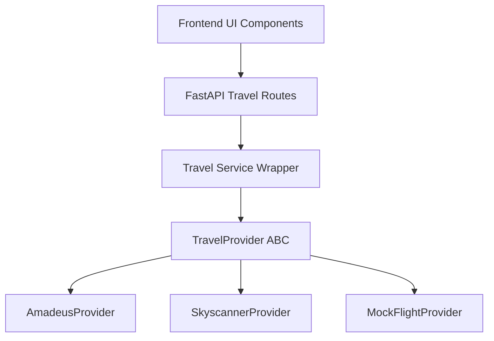

# Scout Travel Provider Integration Architecture

This document describes how third-party travel and booking APIs will integrate into the Scout backend Travel Intelligence Layer.

---

## 1. Unified Interface Model

Scout prevents third-party lock-in by using abstract provider classes. When real APIs are connected in the future, the backend route handlers and frontend UI components will remain unchanged, as they consume the unified outputs defined below.



---

## 2. Flight Tracking Architecture

### Abstract Class
Defined in `backend/app/services/travel/flight_service.py` as `TravelProvider`:

```python
class TravelProvider(ABC):
    @abstractmethod
    def search_flights(self, origin: str, destination: str, departure_date: str) -> list:
        pass
```

### Planned Integrations
1. **Amadeus self-service flight search API**: Best for finding real-time options with flight schedules, coordinates, and prices.
2. **Skyscanner API**: Used to aggregates prices and deep-link directly to booking agents.
3. **Kiwi Tequila API**: Ideal for multi-city flight connections (important for tournament stage routing).
4. **TravelPayouts API**: Used for commission/monetization tracking when fans finalize booking.

---

## 3. Bus & Ground Transport Architecture

### Planned Integrations
1. **FlixBus API**: Standard intercity bus transport in the US, Mexico, and Europe. Exposes direct station-to-station routing.
2. **Busbud API**: Aggregator API to fetch routes for multiple bus carriers.
3. **RedBus API**: Strong local coach booking support in key regional areas.

---

## 4. Hotel Discovery & Booking Architecture

### Unified Format
Returns:
```json
{
  "provider": "Booking.com",
  "price": "$125/night",
  "availability": "4 rooms remaining",
  "last_updated": "2026-06-10T21:00:00Z"
}
```

### Planned Integrations
1. **Booking.com API / Affiliate Program**: Primary source for local hotel reservation options.
2. **Expedia Rapid API**: Renders lodging availability and hotel photos.
3. **Amadeus Hotels API**: High-quality hotel searching matching destination city coordinates.

---

## 5. Match Ticket Tracking Architecture

### Unified Format
Returns:
```json
{
  "match": "Quarter Final (Miami)",
  "price": "$180",
  "availability": "Limited",
  "provider": "Ticketmaster"
}
```

### Planned Integrations
1. **FIFA Official Ticket Portal**: Scrapes/polls official tournament ticket availability status for host cities.
2. **Ticketmaster API**: Primary market ticketing partner for host stadiums.
3. **StubHub & SeatGeek APIs**: Secondary resale ticket marketplace APIs tracking price fluctuations for sold-out matches.
