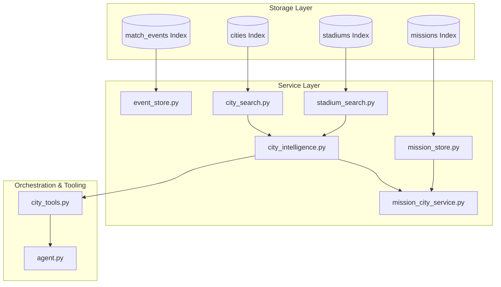

# Scout V1.3 Location/City Intelligence Design

This document details the architectural design for Scout V1.3 (City Intelligence).

## Current Architecture
* **V1.1 (Mission State Machine)**: Tracks mission states (`planned`, `active`, `monitoring`, etc.) and transition rules.
* **V1.2 (Live Tournament Intelligence)**: Ingests real-time tournament progression events (e.g. `group_stage -> round_of_16`), processes them chronologically using an Elasticsearch-backed FIFO queue, and triggers state adjustments/replanning flags.

## V1.3 Architecture
V1.3 introduces **City & Location Awareness** by adding lookup databases, aggregation engines, and integration interfaces for venue/city information. 

## Elastic Schemas

### Cities Index (`cities`)
* `city` (keyword): Primary identifier.
* `country` (keyword): Country code or name.
* `description` (text): Summary of the city.
* `tags` (keyword): Features (e.g. "Coastal", "High Altitude").
* `atmosphere_score` (integer): Hype level (1-100).
* `budget_score` (integer): Relative cost index (1-100).
* `transport_score` (integer): Public transit capability (1-100).
* `fan_zone_score` (integer): Public screening quality (1-100).
* `created_at` (date): Indexing time.

### Stadiums Index (`stadiums`)
* `stadium` (keyword): Primary identifier.
* `city` (keyword): Location city name.
* `country` (keyword): Location country.
* `capacity` (integer): Total seating capacity.
* `description` (text): History or stadium profile.
* `atmosphere_score` (integer): Sound and fan density rating (1-100).
* `transport_score` (integer): Easy access rating (1-100).
* `created_at` (date): Indexing time.

## Data Flow
1. **Seeding & Ingestion**:
   * Initial data stored in `cities.json` and `stadiums.json`.
   * Loaded via python scripts `load_cities.py` and `load_stadiums.py` using `city_name` and `stadium_name` as document `_id` values to prevent duplicate records.
2. **Retrieval**:
   * Search services retrieve cities/stadiums using exact keyword lookups and tag filtering.
3. **Aggregation**:
   * `city_intelligence.py` takes a `city_name`, fetches its core metadata, retrieves all stadiums mapped to that city, and produces a combined intelligence payload.
4. **Mission Integration**:
   * `mission_city_service.py` receives a `mission` dict, parses the itinerary cities, aggregates unified city intelligence, and returns it.

## Integration Points
* **Agent Integration**: `city_tools.py` publishes agent-accessible actions: `get_city_info` and `get_city_stadiums`.
* **Ad-hoc Workflows**: Tool registration within the Google ADK Gemini framework.

## Future Dependencies
* **V1.4 Budget Engine**: Relies on `budget_score` from `cities` and stadium capacity details to model cost calculations.
* **V1.5 Adaptive Replanning**: Utilizes `transport_score`, `atmosphere_score`, and `fan_zone_score` to rank alternative itinerary matches when a team gets eliminated.

## Risks
* **Data Inconsistencies**: Spelling mismatches between cities in itinerary and the `cities` index. Mitigated by strict validation tests.
* **Elastic Search Cloud Rate-limits**: Mitigated by using exact ID lookup methods and bulk ingest safety.
