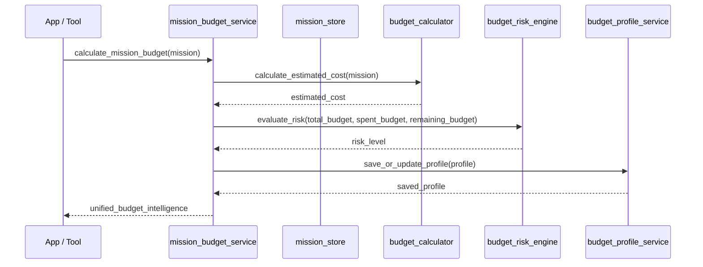

# Scout V1.4 Budget Engine Design

This document details the architectural design for Scout V1.4 (Budget Engine).

## Current Mission Schema
The `missions` index stores documents with the following structure:
* `mission_id` (keyword): Unique identifier.
* `team` (keyword): Selected team (e.g. "Egypt").
* `budget` (integer): Total budget assigned.
* `travel_style` (keyword): Travel mode (e.g. "Comfort", "Budget").
* `objective` (text): Fan's travel goal.
* `mission_state` (keyword): Active mission state machine position.
* `tournament_state` (keyword): Current state of team in tournament.
* `requires_replanning` (boolean): Replanning trigger flag.
* `created_at` (date): Creation timestamp.
* `updated_at` (date): Latest modification timestamp.
* `itinerary` (nested): List of destination details (city, stadium, date).
* `state_history` (nested): Log of state changes.

## Current City Schema
The `cities` index stores documents containing:
* `city` (keyword): City name.
* `country` (keyword): Country name.
* `description` (text): Location summary.
* `tags` (keyword): Descriptive tags.
* `atmosphere_score`, `budget_score`, `transport_score`, `fan_zone_score` (integer): Metric indicators.
* `created_at` (date): Timestamp.

In V1.4, this schema is extended with:
* `daily_cost` (integer): Aggregated baseline day rate.
* `hotel_cost` (integer): Estimated average nightly stay cost.
* `transport_cost` (integer): Estimated local transit cost per day.
* `food_cost` (integer): Estimated average daily meal expense.

## Budget Data Flow

## Storage Strategy
* **Budget Profiles Index (`budget_profiles`)**: Stores the dedicated budget state:
  * `profile_id` (keyword): Match of `mission_id`.
  * `mission_id` (keyword): Reference to parent mission.
  * `team` (keyword): Team identifier.
  * `total_budget` (integer): Set by the user.
  * `spent_budget` (integer): Running tally of expenses (default 0).
  * `remaining_budget` (integer): `total_budget - spent_budget`.
  * `risk_level` (keyword): LOW / MEDIUM / HIGH.
  * `created_at` (date): Timestamp.
  * `updated_at` (date): Timestamp.

## Future V1.5 Dependencies
* **Adaptive Replanning**: When a tournament event triggers replanning, the budget engine will calculate the remaining budget to filter valid alternative itineraries (e.g. if remaining budget is low, filter only low-cost alternative host cities).
* **Fan Preference Engine**: Balance budget risks with user preferences (e.g. higher-budget fans get prioritized stadium seats, lower-budget fans get fan zone recommendations).

## Elastic Usage Plan
* **Cities Cost Search**: The search service query returns cost metadata for sum aggregation.
* **Deterministic IDs**: Budget Profile document ID is set exactly to the `mission_id` to enforce a 1:1 mapping and ensure updates overwrite stale profiles.
