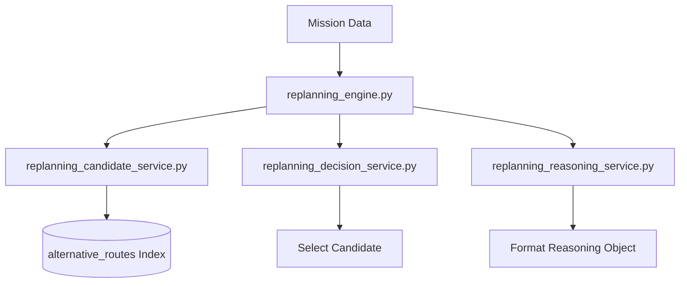

# Scout V1.5 Adaptive Replanning Architecture Design

This document details the architectural design for Scout V1.5 (Adaptive Replanning).

## 1. Current Replanning Flow
Currently, when a team is eliminated, `pivot_engine.py` calls `rebuild_trip(team)` inside `replanner.py`.
The current `rebuild_trip(team)` functions as follows:
* Retrieves the latest mission from Elasticsearch.
* Calls `get_alternative_routes()` from `alternative_search.py`.
* Loops through the alternative routes and selects the first one matching the mission's `travel_style`.
* Returns the selected route details with a status of `"replanned"`.

## 2. Existing Replanning Debt
* **Lack of Modular Pipeline**: Search, decision, and routing are tightly coupled within `rebuild_trip()`.
* **No Explanation layer**: There is no explanation object returned detailing why a destination was chosen.
* **No Extendability**: Adding budget filtering or vector similarity checks requires refactoring the core logic instead of plugging into a pipeline.

## 3. New Architecture
The new design decouples the replanning logic into distinct services orchestrated by a single engine.

## 4. Service Responsibilities
* **`replanning_engine.py`**: Runs the pipeline sequentially (Candidates -> Decision -> Reasoning) and returns recommendations.
* **`replanning_candidate_service.py`**: Queries Elasticsearch for possible routing candidates.
* **`replanning_decision_service.py`**: Picks the optimal route from candidates (currently first candidate).
* **`replanning_reasoning_service.py`**: Formulates reasons explaining the choice.

## 5. Data Flow
1. `run_replanning(mission)` invoked.
2. `get_candidates(mission)` queries the `alternative_routes` index.
3. `choose_candidate(candidates)` receives candidates list and selects the best one.
4. `generate_reasoning(decision)` creates an explanation payload.
5. Unified payload `{"recommendation": decision, "reasoning": explanation}` is returned.

## 6. Future MCP Integration Point
In future phases, the `replanning_engine.py` will expose `run_replanning` as a tool to Model Context Protocol (MCP) clients, enabling external AI clients to trigger agentic replanning directly.

## 7. Future Probability Engine Integration Point
The `replanning_decision_service.py` will integrate with a probability engine to weigh candidates based on matching probabilities of future matches (e.g. odds of a match taking place at that destination).

## 8. Future Maps Integration Point
The `replanning_candidate_service.py` or routing utility will integrate with Maps API to verify transit feasibility and calculate actual transit times for each candidate.
